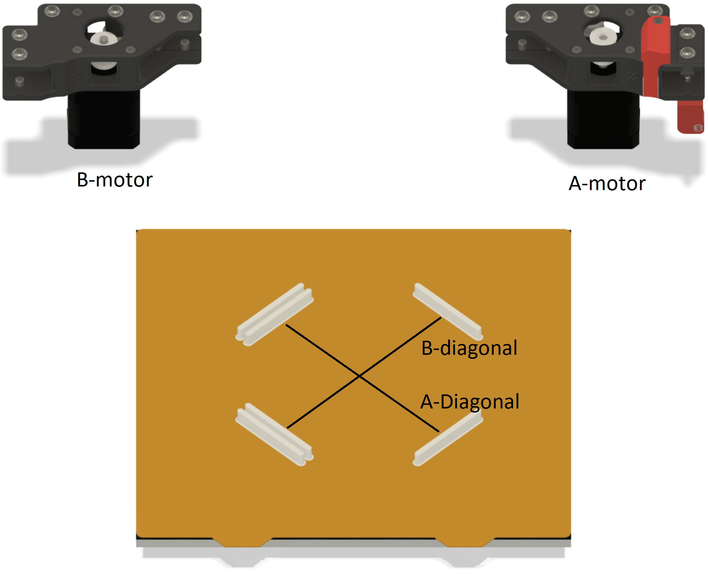
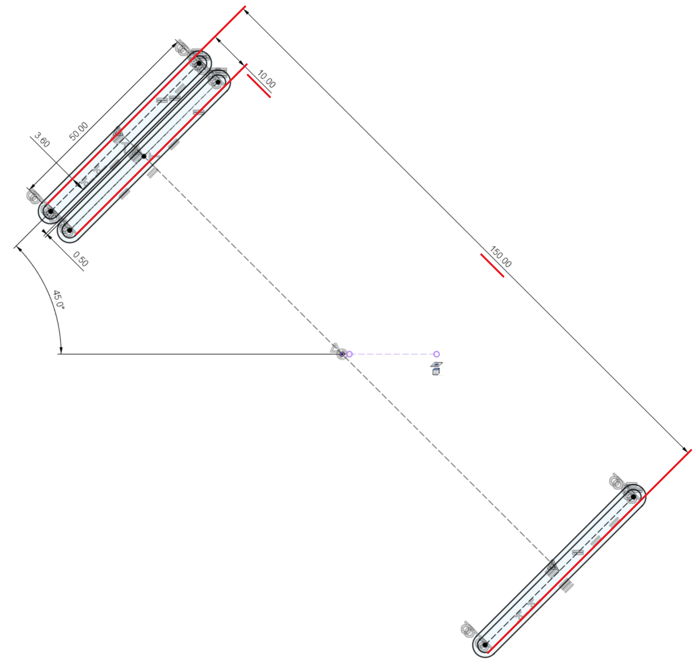
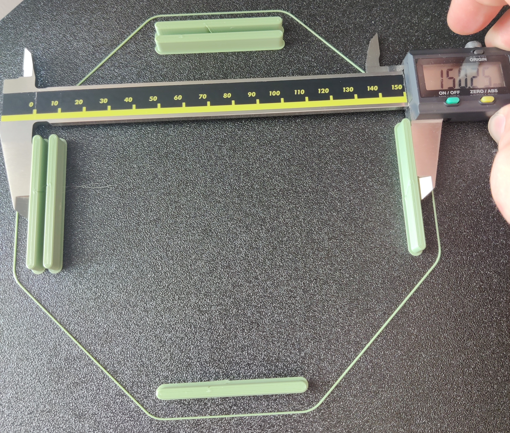

# XY Differential Calibration

## How is This Different from Other Calibration Procedures?
Other calibration procedures typically fall into two categories:
1. Use a dial gauge indicator to calibrate XYZ movements directly [like Teaching Tech does](https://teachingtechyt.github.io/calibration.html#xyzsteps).
2. Print a part, measure some dimensions and compare them to the intended length and use the resulting scale factor, possibly after averaging like [Calibration Bro](https://www.printables.com/model/164261-calibration-bro-calibration-shape-calculator-klipp) or the non-free [Califlower](https://vector3d.co.uk/product/califlower/) by V3D.

The first category (1) above suffers from difficult setup and a short travel distance on the indicator meaning that any errors from setup or instrument have a proportionally large impact on the final calibration as well as limiting the precision, in particularly on CoreXY printers the setup is bordering on impossible in the presence of even tiny amounts of skew. The second category (2) suffers from issues where the presence of material shrinkage and/or thermal expansion of the print bed are not accounted for, or they calibrate in the XY dimension while the `rotation_distance` and `steps_per_mm` values are given for the A/B motors in CoreXY printers, and thus in general this method result in an incorrect calibration for XY steps/rotation distance.

The method proposed here uses the difference between two measurements (therefore it's a "differential measurement") on the same axis to cancel out effects of extrusion width and material shrinkage, it also measures along the A/B axis for CoreXY printers to directly calibrate the `rotation_distance` and `steps_per_mm` values, as well as provide steps to mitigate the effects of thermal expansion of the build plate.

## Before We Start
This is a difficult calibration process for experts. It requires 1: That you are able to be to measure accurately and consistently and 2: That you follow all the instructions exactly, as they are designed to cancel out various sources of error. If your measurements are not on-point or you don't control the error sources as instructed, you may end up with a worse calibration than your starting point.

Expect to spend an evening/afternoon on this process.

Note: These instructions apply for CoreXY printers running Klipper. The method itself can be adapted to some other kinematics and firmware combinations. But that's out of scope for this document.

Details about why this works and is correct are explained in: [differential-ab-calibration.pdf](differential-ab-calibration.pdf).

## What to Expect in Terms of Results
I reduced the scale error from (0.221%, -0.157%) to (0.007%, 0.007%) for the B- and A-diagonals respectively.

The 150mm reference dimension before calibration measured as 150.24 mm and 149.68 mm on the B- and A-diagonals respectively. This is after material shrinkage so only indicative of the relative difference between A and B. After calibration the same dimensions measured 149.92 mm and 149.93 mm respectively, again, in the presence of material shrinkage.

For reference, based on repeated measurements, I estimate that I can consistently measure the reference dimensions to within 0.01 mm indicated on my digital calipers. The factory calibration certificate states an indicated error of -0.02mm on the 150mm range and 0.00mm on sizes less than 50mm. This yields a total, maximum estimated error (instrument + technique) on the differentical measurement of ±0.03 mm, which works out to ±0.0086 in the rotation distance (or about ±8.6 µm per full rotation of the pulley). This is possible thanks a high precision (-0.02mm) error in relation to the long measurement distance (150mm). If you do not believe this, I recommend you read [differential-ab-calibration.pdf](differential-ab-calibration.pdf). It's worthwhile noting, that I could achieve a higher accuracy by compensating my measurements with the calibration error as indicated on the cal-cert. 

## Requirements

For this calibration procedure you will need the following:
* Digital calipers, at least 150mm long, with a precision of 0.01mm.
  - If you need a recommendation, nobody has ever gotten fired for buying Mitutoyo.
* Some high quality filament with consistent cross-sectional area.
  - If you need a recommendation, Prusament PETG is a good option.
* A steady hand.
* A Core XY printer running Klipper to calibrate and a free evening :)

## Preparation

* On the printer
  * Disable skew correction, if present, it must be redone after this calibration is complete.
  * Reset the `rotation_distance` in the `[stepper_x]` and `[stepper_y]` sections to the default, calculated value (40 for most Vorons).
  * If you intend to run input shaper, do it before to improve accuracy of the calibration model part, and again after the calibration to adjust for the scale change in the motor steps. 
* In the slicer, slice the [calibration model](stl/AB-Rotation%20Distance%20Calibration%20Model.3mf):
  * Calibrate Pressure Advance for your material of choice, this improves accuracy of the calibration print.
  * Use `External Perimeter First` to make sure the outside perimeters are as consistent as possible.
  * Set extrusion width to 0.6 mm.
  * Use 5 perimeters to make the model solid material to reduce errors from deflection when measuring.
  * Reduce your extrusion multiplier by about 10%. Make sure you're not over extruding anywhere, under extrusion is better.
  * Slow down the print, we want accuracy and consistency. I recommend 60 mm/s and 800 mm/s^2 for X and Y.
  * Make sure the seams are positioned away from the measurement surfaces. See the picture below: 
  * Disable brim, there's a built in brim.
  * Use the same bed and nozzle temperature for all layers, and use the lowest bed and nozzle temperature you can get away with. We want the minimum amount of thermal expansion both of the build plate and the filament.
  * Disable cooling fan and use a printing enclosure if possible. We want the part to stay warm until the print is over so it shrinks uniformly.

**A note on the print settings:** Contrary to what V3D says in [STOP Printing Calibration Cubes!](https://www.youtube.com/watch?v=dbWAhb40kG4&t=445s) you must make the above changes to your print settings to get an accurate calibration. Remember, we're calibrating the physical movement of the toolhead, not the print itself, therefore we must make sure that the print settings accommodate this as far as possible. Further calibration like for example shrinkage, elephant's foot, extrusion multiplier, etc., needs to be applied after the XY motion has been calibrated to achieve accurate parts. This method is not a panacea.

## Print & Measure

Please read this section completely before starting.

1. Print the G-Code created above.
1. Make sure to keep the bed heated, and keep the print on the bed after the print finishes to avoid thermal expansion of the bed messing up the measurements.
1. Create a copy of the [calculation spreadsheet](https://docs.google.com/spreadsheets/d/12_Dv7_rYfVe8zgUhWrPeNcvSJCttsugQXTOSlCp6MAc).
1. Familiarize yourself with the naming convention of the axis to measure along: 
1. Familiarize yourself with the dimensions to be measured in: 
1. The two distances marked with red above should be measured on both the A and B diagonal.
1. With the part still on the bed, measure the 10 mm and 150 mm distances on the A-axis with the print still on the print bed. Type these into the spreadsheet.
   - You may need to remove panels for your calipers to fit. If you must remove the print bed for measuring, you must measure quickly before the print sheet cools down and contracts. The calibration will be less accurate.
1. Measure the above distances on the A-axis two times more each, to make sure you're measuring consistently. If the measurements aren't within 0.02 mm then you need to improve your measurement technique until they are.
1. Do the same for the B-axis.
1. Take the new values for the `rotation_distance` from the spreadsheet for both the `[x_stepper]` and `[y_stepper]`, and put into the matching sections in your Klipper config.

## Verify Calibration

1. Make a note of the measured values for each dimension on each axis, you may need them later.
1. Move the `New Rotations` value into the `Old Rotations` field on both axis.
1. Next you must repeat the calibration process from step 1 in the "Print & Measure" section above.

If after the second round of calibration, the `Scale Error` on both axes is smaller than 0.025% (that's slightly more than 0.02 mm error over 150 mm), and you're certain that your measurements are consistent, then proceed to the section "After Calibration"

If not, see the "Troubleshooting" section below.

## After Calibration
Congratulations! Your X and Y axis are now calibrated to a very high degree of accuracy.

After completing the XY calibration procedure you need to do some things:
* Re-run input shaper. Because the `rotation_distance` has changed so has the frequency. 
* Re-do skew correction. You might find that it's no longer necessary as your XY axis are now matched to each other.
* Consider resetting extrusion multiplier on your material profiles. As the distance between perimeters has changed with the calibration, the extrusion multiplier might no longer be correct.

## Troubleshooting

If the spreadsheet shows a larger `Scale Error` on both axis after the second calibration round, that typically indicates that you got the `rotation_distance` for `[x_stepper]` and `[y_stepper]` swapped. You can re-enter the measured values from the first calibration round with the default value for the `Old Rotations` to save yourself one calibration round.

Other possible causes for the `Scale Error` being too high is measuring inconsistency (see "Measuring Tips" below), or failure to control all the parameters that affect the surface quality in the "Preparation" section. Please review the slicing parameters, and re-slice as necessary.

Sometimes, if the A/B steppers measured notably different values, then it might be necessary to re-do the calibration 2-3 times as each run successively removes some skew, which improves your measurements iteratively.

Depending on how large the `Scale Error` is, you may chose settle for a larger value. However remember that the value 

## Measuring Tips
When measuring, make sure that:

* Both jaws are making parallel contact with the measuring surfaces by applying light pressure on the mid point of the jaws
* Both jaws are making contact on the same height of the printed part, just below the top layer.
* You're not pressing so hard that the part deflects. If you back off on the pressure and the measured value increases, that means that you're pressing too hard as the material flexes back once you release the pressure.
* Measure each distance 3-4 times, removing the calipers each time. If you get the same value to within 0.02 mm each time, you'r probably doing it right.

The below pictures show me measuring (one handedly, while holding a camera) the 150 mm and 10 mm reference dimensions respectively:

