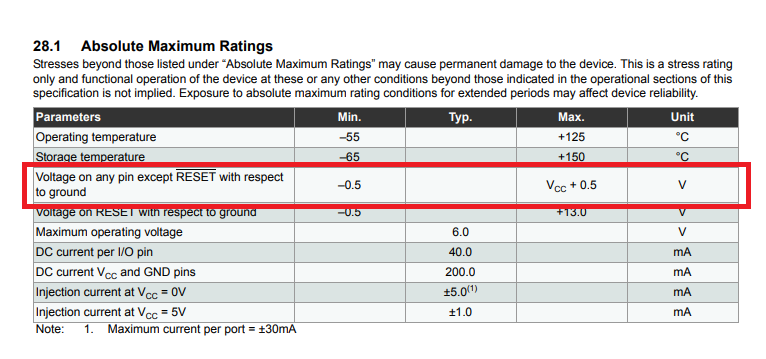
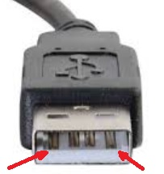

# Don't drive IO pins on unpowered devices

## Wat? What does this even mean?
If you open up the data sheet of just about any Integrated Circuit (IC) chip or MCU you will see a section that looks something like this:

which says that the voltage on any pin may not be higher than the chips supply voltage (Vcc) + 0.5 V. The exact value varies between chips, and is typically between 0.15 V and 0.6 V.

In particular what this means, is that if the IC or MCU isn't powered, you must make sure that nothing is trying to communicate with it via UART, I2C, SPI, USB, or otherwise applies a voltage on any input pin of the chip.

Some chips or pins can be specifically designed to handle voltages above Vcc (like the RESET pin on the ATmega 328p, or your TV's antennae connection). But that's only the case if it's explicitly required for the device to function correctly.

## OK, why is this bad tho?
The reason for this limit is that there is almost always an internal ESD protection diode on all non-power pins. This diode will divert the energy of a ESD event from you touching the chip into the beefy internal power grid instead of the dainty pin circuitry that would otherwise be destroyed.

_These ESD diodes are the reason you don't automatically destroy every electrical doohickey that you touch, and why you often get away without using an ESD strap_

However, these ESD diodes are only designed to absorb very short voltage spikes with low charge, and typically cannot handle even a few mA of continuous current.

So, if you apply a voltage on a pin that exceeds the current supply voltage (Vcc) of the chip, you're forcing a current to flow through the ESD diode which will burn it out. If this doesn't already destroy the pin's circuitry by proximity; then the next time you touch any wire that connects to the pin, you likely will.

## Aight, driving IO pin on an unpowered device is bad. How avoid?
There are two things you need to do:

1. Make sure that everything that communicates via wires is always powered on at the same time.
   * In particular, do not use a relay to switch off the power to your main board while leaving your Raspberry Pi (or other SBC) powered and connected to the main board via USB/UART. Typically this won't save a lot of power anyway.
   * If you really need to be able to remotely switch the power of the printer, then use a separate Raspberry Pi (or better yet, an ESP32 or similar MCU) that only controls the relay and isn't connected to the rest of the electronics.
1. Do not hot plug cables that aren't designed for it.
   * Hot-pluggable connectors such as SATA and USB are specifically designed so that ground and power pins make physical contact before any data lines. This makes it physically impossible to drive the IO pins before the chip has power. See for example the two outer pins on this USB-A cable:
   * 
